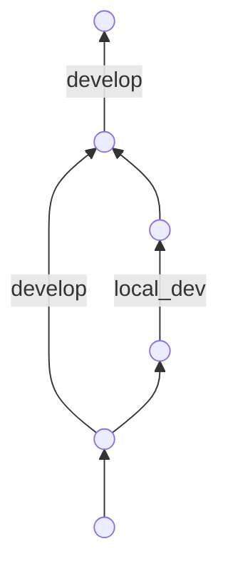

# 開發方式

## 執行語法

```bash
npm run dev
# or
yarn dev
```

## 開發網址

網站 listen 在 [http://localhost:3000](http://localhost:3000).

## 開發習慣

基本上都遵從 react 的寫法，但元素內的屬性行為等等需要包裝成方法，希望能夠使用 DDD 以及 function 的方式來開發，達到見到的內容即為業務邏輯的效果，在程式內容不需要因為個人的習慣多做揣測將共同定義好的業務邏輯類別化直接轉換為 func 名稱等等。

```react
// like

...

className={`${item.current ? 'bg-gray-900 text-white' : 'text-black-300 hover:bg-gray-700 hover:text-white'
} rounded-md px-3 py-2 text-sm font-medium`}

...

// =>

...

function clickedClass(current: (Boolean)): string {
  let css = [(current ? 'bg-gray-900 text-white' : 'text-black-300 hover:bg-gray-700 hover:text-white'), 'rounded-md px-3 py-2 text-sm font-medium'];
  return css.join(" ");
}

className={clickedClass(item.current)} 

...

```

## 版控

目前希望一個禮拜合併開發 (develop) 進主線 (master) 一次，合併方式是 squash merge。
開發分支 commit 方式為

```bash
---- 目前在 develop
# 同步 develop 到最新版
---- 目前在 local_dev
# commit 所有變動
git add .
git commit -m <content text>

# or

git commit -a -m <content text>

# or 

git add <filename>
...
git commit -m <content text>

# 先重置到最新版
git rebase develop

# 合併進主要分支
---- 目前在 develop
git checkout develop
git merge jacob_dev --no-ff

=======

基本上都遵從 react js 的寫法，但元素內的屬性行為等等需要包裝成方法，希望能夠使用 DDD 以及 function 的方式來開發，達到見到的內容即為業務邏輯的效果，在程式內容不需要因為個人的習慣多做揣測將共同定義好的業務邏輯類別化直接轉換為 func 名稱等等。

```react
// like

...

className={`${item.current ? 'bg-gray-900 text-white' : 'text-black-300 hover:bg-gray-700 hover:text-white'
} rounded-md px-3 py-2 text-sm font-medium`}

...

// =>

...

function clickedClass(current: (Boolean)): string {
  let css = [(current ? 'bg-gray-900 text-white' : 'text-black-300 hover:bg-gray-700 hover:text-white'), 'rounded-md px-3 py-2 text-sm font-medium'];
  return css.join(" ");
}

className={clickedClass(item.current)} 

...

```

## 版控

目前希望一個禮拜合併開發 (develop) 進主線 (master) 一次，合併方式是 squash merge。
開發分支 commit 方式為

```bash
---- 目前在 develop
# 同步 develop 到最新版
---- 目前在 local_dev
# commit 所有變動
git add .
git commit -m <content text>

# or

git commit -a -m <content text>

# or 

git add <filename>
...
git commit -m <content text>

# 先重置到最新版
git rebase develop

# 合併進主要分支
---- 目前在 develop
git checkout develop
git merge jacob_dev --no-ff
```

最下面的 git merge 語法為此用意


